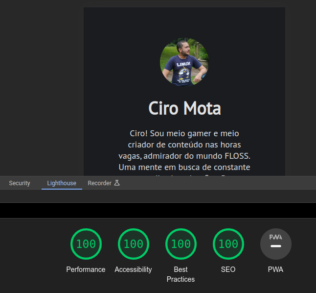

<table align="right">
 <tr><td><a href="https://github.com/ciro-mota/simple-linktree/blob/main/README.md">:us: English</a></td></tr>
 <tr><td><a href="https://github.com/ciro-mota/simple-linktree/blob/main/README.pt-br.md">:brazil: Português</a></td></tr>
</table>

<h2 align="center">🌲 Simple Linktree</h2>

    
    
    
    

## 💡 About this project

This is an open source project that serves as a clean, free and faster alternative to the Linktree website. You can see online through the link below:
- [**DEMO**](https://links.ciromota.tec.br/)

## 🎁 Sponsoring

If you like this work, give me it a star on GitHub, and consider supporting it:

## ✨ Features:

### ☀️ Clean 

No Javascript, just only HTML and CSS.

### 🔓 Telemetry Free

No addition of third-party telemetry elements

### 🚀 Performance

## 🎨 Customization

You can:

- Change the profile image.

Replace the `profile.jpg` image inside the `img` folder.

- Change the colors in the `style.css` file.

To change the background and other color elements. Go to the `style.css` inside the `css` folder and edit lines 4 of up to 8.

## 💻 Deploy

